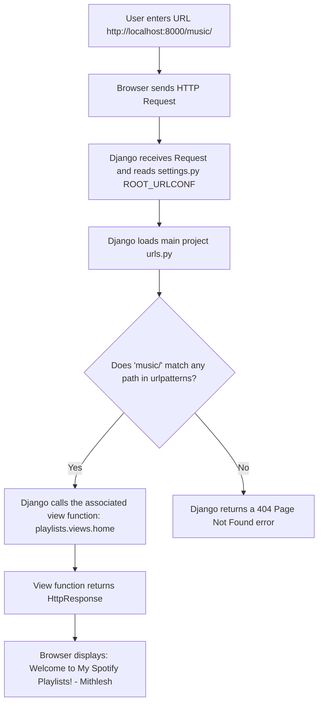

# Django Assignment: Theory & Concept Guide (Session 2)

This document provides a comprehensive, beginner-friendly explanation of the fundamental Django concepts used in this assignment. It is formatted to be ready for assignment submission.

---

## 1. Creating a Django App

### What is a Django App?
In Django, a **Project** represents the entire web application (including settings, database configurations, and main routing). An **App** is a self-contained web application module within the project that performs a specific function (e.g., a blog system, a payment gateway, or in this case, a playlists manager). 

A single Django project can contain multiple apps, making code reusable and modular.

### How to Create an App
To create a new app, we use Django's command-line utility `manage.py` with the `startapp` command:
```bash
python manage.py startapp playlists
```

### Auto-Generated Files Structure
When you run this command, Django automatically generates a folder named `playlists` containing the following standard files:

*   **`migrations/`**: A folder that stores migration files (records of database schema changes over time).
*   **`admin.py`**: Used to register models so that they appear in the built-in Django Admin Interface.
*   **`apps.py`**: Contains configuration metadata for the app itself (like the app name).
*   **`models.py`**: The file where we define our database tables using Python classes (Django ORM).
*   **`tests.py`**: Used for writing unit tests to test the app's business logic.
*   **`views.py`**: Contains Python functions or classes (views) that receive web requests and return web responses.

---

## 2. The `INSTALLED_APPS` Setting

### Purpose
The `INSTALLED_APPS` setting is a list defined in the main project's `settings.py` file. It tells Django which applications are active in the current project. 

Django will only search for models, templates, admin panels, and management commands in the apps listed in this setting.

### Why Registering Your App is Mandatory
By default, when you create a new app using `startapp`, Django does not automatically register it. If you forget to add your app to `INSTALLED_APPS`:
1.  Django will not discover any database models defined in `models.py`.
2.  Migrations for the app will not run (`makemigrations` and `migrate` will ignore the app).
3.  Templates or static files inside the app may not load.

### Code Syntax in `settings.py`
```python
INSTALLED_APPS = [
    'django.contrib.admin',
    'django.contrib.auth',
    'django.contrib.contenttypes',
    'django.contrib.sessions',
    'django.contrib.messages',
    'django.contrib.staticfiles',
    
    # Custom apps go here
    'playlists', 
]
```

---

## 3. Views in Django

### What is a View?
A **View** in Django is a request handler. It is a Python function or class that accepts an HTTP request from a web browser, processes any required business logic (such as querying a database or rendering a template), and returns an HTTP response.

### Function-Based Views (FBVs) vs. Class-Based Views (CBVs)
Django supports two types of views:
1.  **Function-Based Views (FBVs)**: Simple Python functions. They are easy to read and ideal for beginners and straightforward logic.
2.  **Class-Based Views (CBVs)**: Object-oriented classes that help implement reusable view structures (like ListViews and CreateViews).

### Role of `HttpResponse`
The `HttpResponse` class (imported from `django.http`) allows us to return plain text, HTML, or raw data directly back to the client browser without loading an external HTML file.

```python
from django.http import HttpResponse

# A beginner-friendly function view
def home(request):
    return HttpResponse("Welcome to My Spotify Playlists! - Mithlesh")
```

---

## 4. URL Mapping (Routing)

### What is URL Mapping?
URL mapping is the process of linking a web browser's requested URL (like `/music/`) to a specific view function (like `home`) in Python. 

Without URL routing, Django will not know which code to run when a user visits a particular address on your website.

### How Routing Works Internally (Step-by-Step)
When a user enters a URL in their browser (e.g., `http://localhost:8000/music/`):



1.  **Incoming Request**: The web browser sends an HTTP request to the server.
2.  **Lookup ROOT_URLCONF**: Django looks at the `ROOT_URLCONF` setting in `settings.py` to identify the root routing file (usually `urls.py`).
3.  **Match URL Pattern**: Django matches the request URL path (ignoring the domain name and query parameters) against the list of paths in `urlpatterns` sequentially.
4.  **Execute View**: Once a match is found (e.g., matching `'music/'`), Django imports and executes the mapped view function (`home(request)`), passing the request details.
5.  **Return Response**: The view returns an `HttpResponse` object, which Django translates into an HTML stream sent back to the browser.

---

## 5. Real-Time Reloading in Django

### What is the Auto-Reloader?
Django’s development server (`runserver`) has a built-in file watcher. Whenever you modify and save any Python file (like a view, a model, or a URL configuration) or HTML template, Django automatically detects the change, restarts the server processes in milliseconds, and reloads the configuration.

### How it Works
1.  Django monitors modification times of files in active apps listed under `INSTALLED_APPS`.
2.  Upon detecting a file save, it re-compiles the code.
3.  If successful, the running server refreshes immediately. If there is a syntax error, the server pauses and outputs the error trace to the terminal, resuming once you fix the error and save the file.

---

## 6. Common Mistakes Beginners Make

*   **Forgetting to add commas in lists**: E.g., omitting the trailing comma after adding `'playlists'` in `INSTALLED_APPS` lists, causing syntax errors.
*   **Missing imports**: Forgetting `from django.http import HttpResponse` before returning `HttpResponse`.
*   **Trailing Slashes**: Forgetting to add the trailing slash in the URL path definition (e.g., writing `path('music', ...)` instead of `path('music/', ...)`). Django by default redirects non-slash requests to slash urls.
*   **Incorrect `ROOT_URLCONF` config**: Modifying settings in a way that breaks Django's path lookup.
*   **Not Activating Virtual Environment**: Running `python manage.py` commands in a global python scope where Django is not installed.
